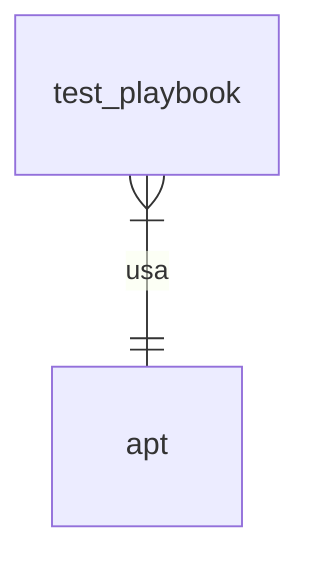

# prueba2

[](https://git.constrict0r.org/ansible/prueba2)

Otra prueba.

## Índice

- [Instalación](#instalación).
- [Playbooks](#playbooks).
- [Roles](#roles).
- [Vault](#vault).
- [Dependencias](#dependencias).
- [UML](#uml).
- [Desarrollo](#desarrollo).
- [Pruebas](#pruebas).
- [Licencia](#licencia).
- [Autor](#autor).

## Instalación

Para instalar la colección ejecute los siguientes pasos.

Instale la colección:

```
ansible-galaxy collection install git@git.constrict0r.org:ansible/prueba2.git
```

Esto instalará la colección en la ruta
`~/.ansible/ansible_collections/constrict0r/prueba2`.

Instale los roles dependencia:

```
ansible-galaxy install \
    -r ~/.ansible/collections/ansible_collections/constrict0r/prueba2/requirements.yml
```

## Playbooks

Se listan los playbooks incluidos en esta colección.

| Nombre | Descripción | Ejecución |
| --- | --- | --- |
| [test_playbook](playbooks/test_playbook.yml) | Playbook de prueba. | `ansible-playbook constrict0r.prueba2.test_playbook -i inventory-test.yml -l mi_grupo` |

Puede ejecutar un *playbook* con un comando similar a:

```
ansible-playbook constrict0r.prueba2.test_playbook \
    -i inventory.yml \
    -l mi_grupo --ask-vault-pass
```

Si quiere pasar variables externas puede usar el comando:

```
ansible-playbook constrict0r.prueba2.test_playbook \
    -i inventory.yml \
    -l mi_dominio.org \
    -e @/home/user/mis-vars.yml
```

## Roles

Se listan los roles incluidos en esta colección.

| Nombre | Descripción |
| --- | --- |
| [test_role](roles/test_role/README.md) | Rol de prueba. |


## Vault

El *vault* es usado para almacenar variables encriptadas.

Para ejecutar un playbook que usa variables encriptadas ejecute:

```
ansible-playbook constrict0r.prueba2.test_playbook \
    -i inventory.yml \
    -l mi_dominio.org --ask-vault-pass
```

Si no desea escribir la contraseña para el *vault* en cada ejecución,
agregue el archivo oculto *.vault_pwd* con la contraseña **en claro** en él,
este es un archivo local únicamente y se encuentra ignorado en el archivo
*.gitignore*, luego ejecute el *playbook* requerido usando el parámetro
*vault-password-file* en lugar de *--ask-vault-pass*:

```
ansible-playbook constrict0r.prueba2.test_playbook \
    -i inventory.yml \
    -l mi_dominio.org --vault-password-file .vault_pwd
```

### Encriptar archivo de variables

Para encriptar un archivo de variables completo ejecute:

```
ansible-vault encrypt group_vars/all.yml
```

Para ver el archivo de variables ejecute:

```
ansible-vault view group_vars/all.yml
```

Para editar el archivo de variables:

```
ansible-vault edit group_vars/all.yml
```

### Encriptar variable única

Para agregar la variable *exim4_password* como una variable
encriptada a un archivo de variables no encriptado (ej: *group_vars/all.yml*),
ejecute el comando:

```
ansible-vault encrypt_string 'mi_password' -n exim4_password >> group_vars/all.yml
```

Para ver el contenido de una variable encriptada ejecute:

```
ansible localhost -m debug -a var=exim4_password \
    -e @/home/user/.ansible/collections/ansible_collections/constrict0r/prueba2/group_vars/all.yml \
    --ask-vault-pass
```

## Dependencias

### Colecciones

- [ansible.posix](https://docs.ansible.com/ansible/latest/collections/ansible/posix/index.html).
- [community.general](https://docs.ansible.com/ansible/latest/collections/community/general/index.html).

### Roles

- [weareinteractive.cron](https://github.com/weareinteractive/ansible-cron).

### Python

- [ansible](https://pypi.org/project/ansible).
- [flake8](https://pypi.org/project/flake8).
- [molecule[docker]](https://pypi.org/project/molecule-docker).

## Compatibilidad

- Ansible >= 2.11.
- Debian Bullseye.
- Ubuntu Focal.
- Python 3.

## UML

Se muestra la jerarquía de la colección (por servicio).

### Hardening / LXDHub



## Desarrollo

Para configurar el ambiente de desarrollo siga los pasos descritos a continuación.

### Git

Instale Git y clone la colección:

```
git clone git@git.constrict0r.org:ansible/prueba2.git ansible_collections/constrict0r/prueba2
```

El repositorio se clonará en la ruta `ansible_collections/constrict0r/prueba2`,
esta ruta es requerida por Ansible para poder ejecutar el comando
[ansible-test](https://www.ansible.com/blog/introduction-to-ansible-test).

Acceda al directorio de la colección recién clonada:

```
cd ansible_collections/constrict0r/prueba2
```

### Python

- Instale [Pip](https://pypi.org/project/pip):

```
sudo apt install -y python3-pip
```

- Instale [Pipenv](https://pipenv-es.readthedocs.io):

```
pip install pipenv
```

- Cree un ambiente virtual:

```
pipenv shell
```

- Instale los requerimientos de Python:

```
pipenv install
```

- (Opcional) Si desea borrar el ambiente virtual ejecute:

```
pipenv --rm
```

### Docker

Debe instalar [docker y docker-compose](https://docs.docker.com/engine/install/debian).

## Pruebas

Para ejecutar pruebas automatizadas siga los pasos descritos a continuación.

Debe haber [configurado el ambiente de desarrollo](#desarrollo) antes de poder
ejecutar pruebas automatizadas.

### Probar Roles

[Molecule](https://molecule.readthedocs.io/en/latest) es usado para probar la ejecución de roles.

- Acceda al rol que se quiere probar:

```
cd roles/nginx
```

- Ejecute las pruebas de [Molecule](https://molecule.readthedocs.io):

```
molecule test
molecule converge
```

- Verifique el nombre o el número de identificador (*ID*) del contenedor con el comando:

```
docker ps -a

CONTAINER ID   IMAGE                                 COMMAND                  CREATED         STATUS                  PORTS     NAMES
6cf65591e651   geerlingguy/docker-debian11-ansible   "bash -c 'while true…"   3 seconds ago   Up 2 seconds                      instance
```

- Acceda al contenedor usando su nombre o su ID:

```
docker exec -it instance bash
```

### Probar playbooks

Para probar playbooks se ejecuta Ansible contra un contenedor Docker.

- Descargue la imagen Docker para Python:

```
docker pull python
```

- Cree un contenedor Docker a partir de la imagen recién descargada llamado **debian_docker**:

```
docker run -itd --name=debian_docker python
```

- Ejecute el playbook deseado desde la máquina local hacia el contenedor Docker usando el inventario **inventory-test.yml**:

```
ansible-playbook constrict0r.prueba2.test_playbook -i inventory-test.yml -l debian_docker
```

### Probar colección

Se usa [ansible-test](https://www.ansible.com/blog/introduction-to-ansible-test)
para probar la integridad de la colección, siga los pasos descritos a continuación
para ejecutarlo:

- Acceda al directorio de la colección:

```
cd ansible_collections/constrict0r/prueba2
```

- Ejecute las pruebas de sanidad:

```
ansible-test sanity
```

## Licencia

GPL 3.

## Autor


[constrict0r](https://constrict0r.org).